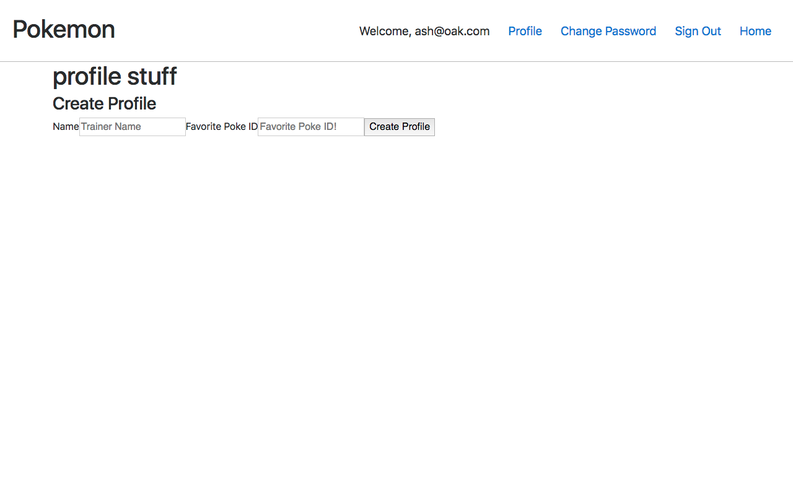

Deployed heroku: https://secure-reaches-50075.herokuapp.com/
Deployed gh-pages: https://liquidsteel49.github.io/pokemon-react-client/
Back-end Repo: https://github.com/liquidsteel49/pokemon-express-api

Wireframe: {
  authenticated user landing: https://imgur.com/OWlKq9m
  game started: https://imgur.com/dK97y16
  unauthenticated landing page: https://imgur.com/UN3LahE
  sign up page: https://imgur.com/XLd9IKU
  profile view w/profile: https://imgur.com/43oN3Df
  profile view w/o profile: https://imgur.com/UKUPhWg
  update profile view: https://imgur.com/LfrOOD2
}

Technologies used: react, express, mongoDB, mongoose, javascript, html, css, and JASON

Replica of the "Who's that pokemon?" game played before and after the commercial break during the original Pokemon TV show. The user must sign up and sign in and before playing. There is also an option to make a profile. This profile will have their trainer name and favorite pokemon name with picture. A profile is not requred to begin playing.

I need to set up a database using a simplified CSV of gen 1 pokemon. This database uses MongoDB and contains a table for user, profile, and pokemon. There will be a relationship between user and profile where one profile will be allowed per user. The website will detect and pull an already made profile using the user ID. The API will be set up using an Express back-end framework. The API will need to GET, POST, PATCH, and DELETE user owned profiles. The API will need to GET pokemon table id, name, silouette, and visable to components.

The front end will use React.

Once signed in the user will be able to play a game where a silouette img is displayed and they will be given a chance to answer if the silouette belongs to the name of the pokemon displayed. There will be 4 unique names to select from, 1 of them being the correct answer and the other 3 being randomly selected. The answers will be randomly sorted as to avoid the correct answer holding the same position every iteration.

When an answer is selected, the silouette img component will be replaced with a visible pokemon img and there will be a ui response to tell the user if they were correct or not. The user will know how many corrected guesses they have made and that information will be stored with their profile information. If there is no profile the information will not be saved. When they delete their profile they will lose all the information stored within.

In later versions the user will be able to look up pokemon imgs even when they are not playing through a "pokedex" component.

Installation & Requirements:
- npm

Unsolved Problems: - Need to get profile to render the created profile or create profile page on clicking the nav bar.
- Will not display profile after creating profile. Provides error "TypeError: Cannot read property '_id' of undefined".
- Need to provide way to update profile.
- Need to provide way to delete profile.
